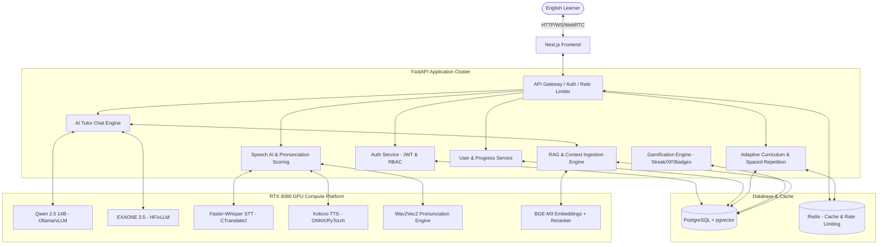
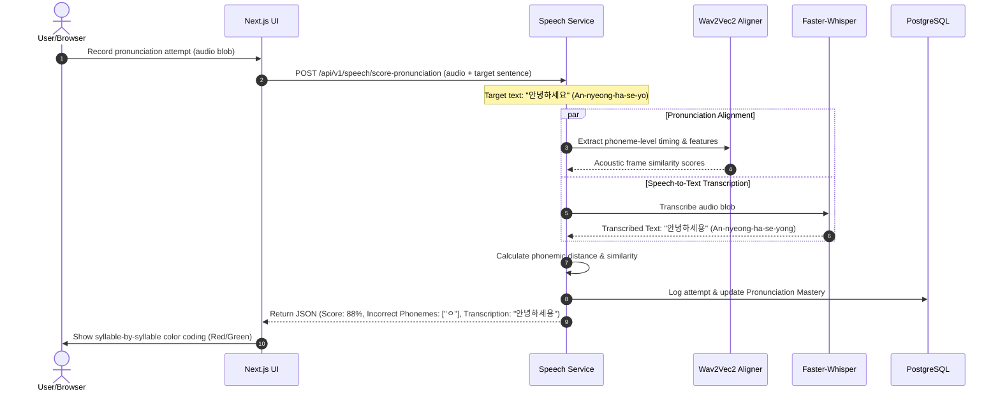
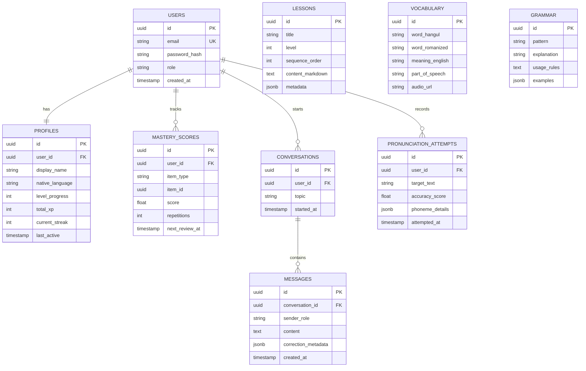

# Implementation Plan - HangeulAI: Production-Grade AI-Powered Korean Language Learning Platform

This document outlines the detailed system design, technology evaluation, architectural patterns, schemas, directory structure, timeline, risk matrix, and cost analysis for **HangeulAI**—a premium, production-grade, open-source AI Korean tutor platform.

---

## 1. Executive Summary

**HangeulAI** is designed to bridge the gap between traditional content-driven curriculum systems (e.g., Duolingo, Talk To Me In Korean) and dynamic LLM-based speech agents (e.g., ChatGPT, ELSA Speak). The system delivers a personalized, adaptive path teaching Korean Hangeul, vocabulary, grammar, reading, writing, listening, and speaking to English-speaking learners.

### Core Value Propositions
* **Curriculum Alignment**: Systematically structured from Level 1 (Absolute Beginner) to Level 10 (Advanced Fluency) mapping to the Common European Framework of Reference for Languages (CEFR A1 to C2).
* **AI Tutor Conversational Engine**: RAG-augmented speech-to-text and text-to-speech agents that perform real-time error correction, grammatical explanations, and pronunciation grading.
* **Open-Source & Locally Deployable**: Leverages high-performance local AI pipelines optimized for consumer GPUs like the **NVIDIA GeForce RTX 4080** to reduce API-dependent operational costs to near zero, while offering robust cloud-deployment bridges.

---

## 2. Technical Evaluation & Decisions

### 2.1 AI Language Model Stack (LLMs)
We evaluated candidate LLMs based on their capability for Korean/English bilingual instruction, grammar explanations, structured JSON output generation, local inference speed, and fine-tuning viability on a single RTX 4080 (16GB VRAM).

| Model Model | Size | Korean / English Capabilities | Quantized VRAM Footprint | RTX 4080 Local Feasibility | Primary Role / Decision |
| :--- | :--- | :--- | :--- | :--- | :--- |
| **Qwen 2.5 14B / 32B** | 14B / 32B | **Excellent** bilingual syntax, grammar & logic. | 14B: ~9-11 GB (Q4_K_M) <br> 32B: ~20-22 GB (Q4_K_M) | **Highly Feasible (14B)** <br> Borderline (32B offloaded) | **Selected Qwen 2.5 14B** for primary high-reasoning local conversational tutoring, translation, and quiz generation. |
| **EXAONE 3.5 7.8B** | 7.8B | **Superb Korean** native understanding, average English instruction. | ~5-6 GB (Q4_K_M) | **Highly Feasible** | **Selected** for specific Korean grammatical parsing, vocabulary definition generation, and local semantic cleanup. |
| **Llama 3.3 70B** | 70B | Strong multilingual, but highly resource-intensive. | ~42 GB (Q4_K_M) | No (Requires offloading / slow) | Rejected for local deployment; viable only through external cloud APIs (e.g., Together.ai/Groq). |
| **Gemma 3 4B / 12B** | 4B / 12B | Excellent English & Korean comprehension, modern architecture. | 12B: ~8-9 GB (Q4_K_M) | **Highly Feasible** | **Selected Gemma 3 12B** as primary lightweight alternative for fast JSON generation and user input classification. |
| **Mistral 7B v0.3** | 7B | Good English, weak native Korean grammar explanations. | ~5 GB (Q4_K_M) | Highly Feasible | Rejected in favor of Qwen 2.5 14B and Gemma 3. |

### 2.2 Embedding & RAG Retrieval Stack
For semantic indexing of grammar notes, books, vocabulary maps, and dialogues:

* **Selected Embedding Strategy**: **BGE-M3 (bge-m3)** or **gte-base-korean**. We choose **BGE-M3** due to its out-of-the-box support for multi-lingual, multi-granularity (dense, sparse, and multi-vector) retrieval.
* **Hybrid Retrieval**: Combine dense semantic search (via `pgvector` Cosine Similarity) with sparse lexical search (PostgreSQL `tsvector` FTS) using **Reciprocal Rank Fusion (RRF)**.
* **Reranking**: **BGE-Reranker-Large** to ensure selected contexts contain the exact grammatical rules required for the user's active level.

### 2.3 Speech Stack
Real-time spoken conversation requires extremely fast execution:

* **Speech-to-Text (STT)**: **Faster-Whisper (whisper-large-v3 quantized to float16 or int8)** running locally via CTranslate2. This drops translation latency to under 300ms on the RTX 4080.
* **Text-to-Speech (TTS)**: **Kokoro-82M** or **MeloTTS**. We select **Kokoro-82M** due to its incredibly high fidelity, single-file lightweight architecture, and extremely low latency (sub-100ms) on local GPUs.
* **Pronunciation Scoring**: Custom Phoneme-Distance Aligner. We extract standard phonemes from native audio clips using a Grapheme-to-Phoneme (G2P) converter for Korean (e.g., `g2pK`), capture learner speech, run forced alignment using **Wav2Vec2-Phoneme**, and compute similarity scores (Cosine + Levenshtein distance) to deliver syllable-by-syllable pronunciation feedback.

---

## 3. System Architecture & Diagrams

### 3.1 High-Level Architecture Block Diagram



### 3.2 Sequence Diagram: Pronunciation Scoring & STT Flow



### 3.3 Entity Relationship Diagram (ERD)



---

## 4. Full Project Directory Tree

The complete structure encompassing Frontend, Backend, Machine Learning notebooks, and DevOps configuration:

```text
HangeulAI/
├── .github/
│   └── workflows/
│       ├── backend-ci.yml
│       └── frontend-ci.yml
├── backend/
│   ├── app/
│   │   ├── __init__.py
│   │   ├── main.py
│   │   ├── core/
│   │   │   ├── config.py
│   │   │   ├── security.py
│   │   │   └── database.py
│   │   ├── models/
│   │   │   ├── user.py
│   │   │   ├── lesson.py
│   │   │   ├── study.py
│   │   │   └── gamification.py
│   │   ├── schemas/
│   │   │   ├── auth.py
│   │   │   ├── user.py
│   │   │   ├── lesson.py
│   │   │   └── speech.py
│   │   ├── api/
│   │   │   ├── v1/
│   │   │   │   ├── auth.py
│   │   │   │   ├── lessons.py
│   │   │   │   ├── tutor.py
│   │   │   │   ├── speech.py
│   │   │   │   └── progress.py
│   │   │   └── router.py
│   │   └── services/
│   │       ├── ai_tutor.py
│   │       ├── speech_ai.py
│   │       ├── rag_engine.py
│   │       └── learning_scheduler.py
│   ├── migrations/
│   │   ├── env.py
│   │   └── versions/
│   ├── tests/
│   │   ├── test_auth.py
│   │   ├── test_lessons.py
│   │   └── test_speech.py
│   ├── Dockerfile
│   ├── requirements.txt
│   └── alembic.ini
├── frontend/
│   ├── src/
│   │   ├── app/
│   │   │   ├── layout.tsx
│   │   │   ├── page.tsx
│   │   │   ├── dashboard/
│   │   │   ├── tutor/
│   │   │   ├── lessons/
│   │   │   └── vocab/
│   │   ├── components/
│   │   │   ├── ui/
│   │   │   ├── LessonPlayer.tsx
│   │   │   ├── PronunciationScoreCard.tsx
│   │   │   └── TutorChatBubble.tsx
│   │   ├── hooks/
│   │   ├── lib/
│   │   └── styles/
│   ├── package.json
│   ├── tailwind.config.js
│   ├── tsconfig.json
│   └── Dockerfile
├── ml_pipelines/
│   ├── 01_dataset_generation.ipynb
│   ├── 02_data_cleaning.ipynb
│   ├── 03_embedding_generation.ipynb
│   ├── 04_rag_evaluation.ipynb
│   ├── 05_sft_training.ipynb
│   ├── 06_lora_training.ipynb
│   ├── 07_qlora_training.ipynb
│   ├── 08_model_evaluation.ipynb
│   ├── 09_inference.ipynb
│   └── 10_pronunciation_scoring.ipynb
├── deployment/
│   ├── docker-compose.yml
│   ├── nginx.conf
│   └── env.example
├── README.md
└── LICENSE
```

---

## 5. Development Timeline

* **Phase 1: Architecture & Technology Decisions (Current)** - Detailed design, schemas, and approvals.
* **Phase 2: Database Schema & Backend Foundation (Days 1–3)** - PostgreSQL configuration, alembic migrations, auth service, rate limits.
* **Phase 3: Frontend Foundation & Component Library (Days 4–6)** - Next.js boilerplate, ShadCN setup, landing page, layouts.
* **Phase 4: AI & Speech Local Engine Setup (Days 7–9)** - Local LLM/CTranslate2 configs, Faster-Whisper, Kokoro TTS integration, Pronunciation scoring.
* **Phase 5: RAG & Curriculum Integration (Days 10–12)** - Document ingestion, pgvector integration, structured TTMIK/CEFR course content.
* **Phase 6: Mastery Estimation & Spaced Repetition (Days 13–14)** - Implementation of SuperMemo-2 / Ebisu algorithm, stats tracker, dashboard.
* **Phase 7: End-to-End Testing & Deployment Scripts (Days 15–16)** - Docker setup, integration testing, CI/CD, final docs.

---

## 8. Financial Cost Analysis

Operating HangeulAI relies on an intelligent hybrid model, leveraging local GPU resources for development and offering standard cost-effective paths for production.

### Development Cost (Single RTX 4080 Workstation)
* **API Cost**: **$0.00** (Local inference of Qwen 2.5, Faster-Whisper, Kokoro TTS, Wav2Vec2)
* **Compute Power Cost**: ~350W peak draw. Approx. $0.05/hour in electricity under heavy load.

### Production Cloud Hosting Options

* **High-Scale Dedicated Setup (Self-Hosted on Lambda Labs/RunPod)**:
  * 1x RTX 4090 or RTX A4000: ~$0.20 to $0.40 / hour ($140 - $280 / month).
  * Backend + Web Host (Railway / Render): ~$15 / month.
  * DB (Supabase/Neon/Self-Hosted PG): ~$15 - $30 / month.
  * **Total Estimate**: ~$170 - $320 / month supporting thousands of daily active users.

* **Serverless Cloud API Setup (Low-Volume SaaS Startup)**:
  * LLM (Groq / Together.ai - Llama-3-8B / Qwen-2.5): ~$0.07 per 1M tokens (average of $0.005 / user / day).
  * Whisper STT (Groq / RunPod Serverless): ~$0.003 / minute.
  * TTS (ElevenLabs or Deepgram): ~$0.015 / 1k characters.
  * **Total Estimate**: ~$10 - $30 / month fixed cost + usage scaling at ~$0.05 / user hour.

---

## 9. Next Steps & Approval Gate

> [!IMPORTANT]
> To maintain the high standards of a production-grade software environment, please review the proposed architecture and tech stack above.
> Once approved, we will begin **Phase 2: Database Design and Backend Foundation**, generating fully executable schemas, Alembic migrations, database models, and the core FastAPI authentication platform.

Please review the plan and provide your approval to proceed to Phase 2.
